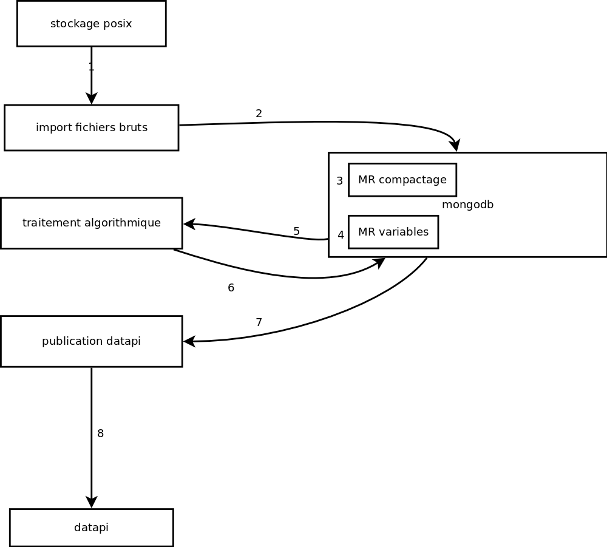
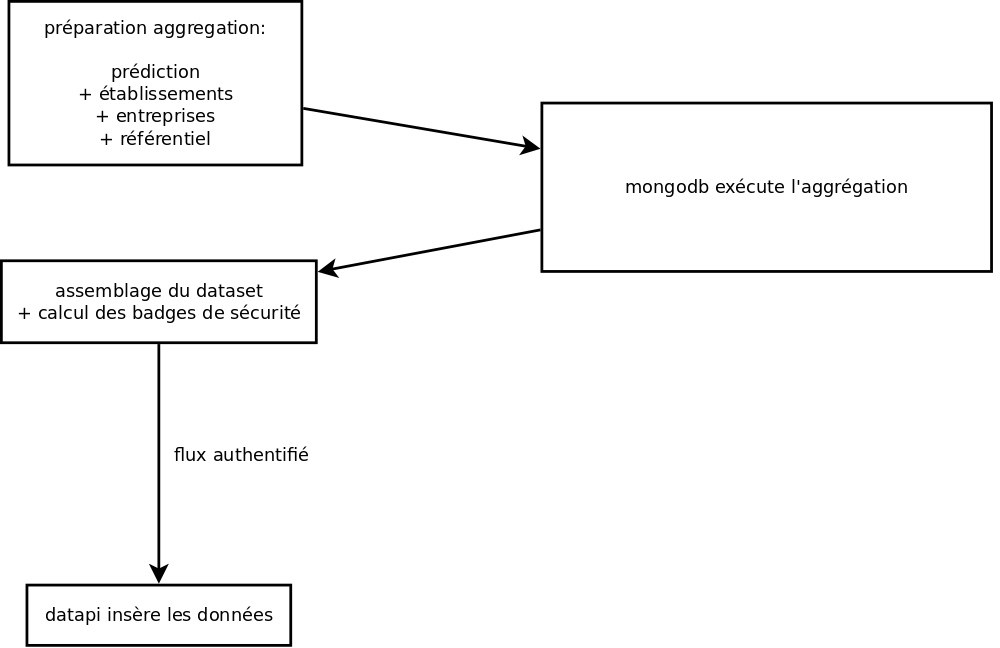
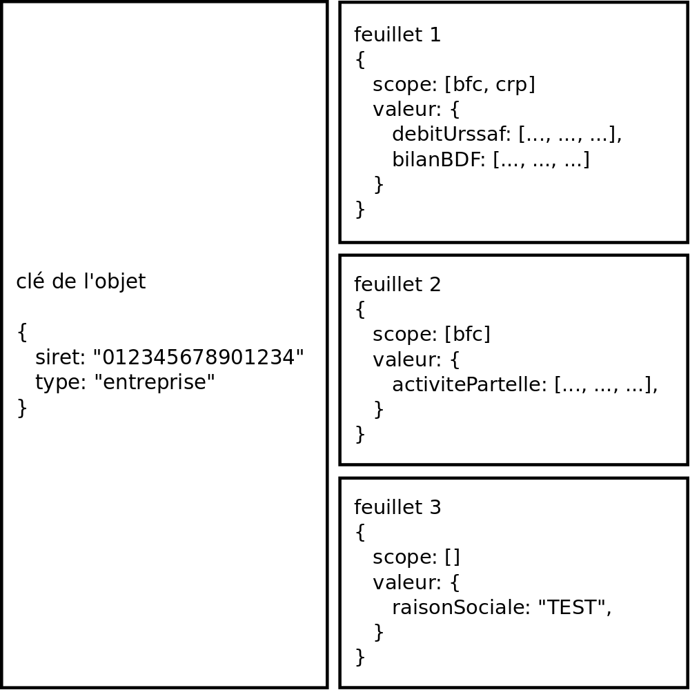
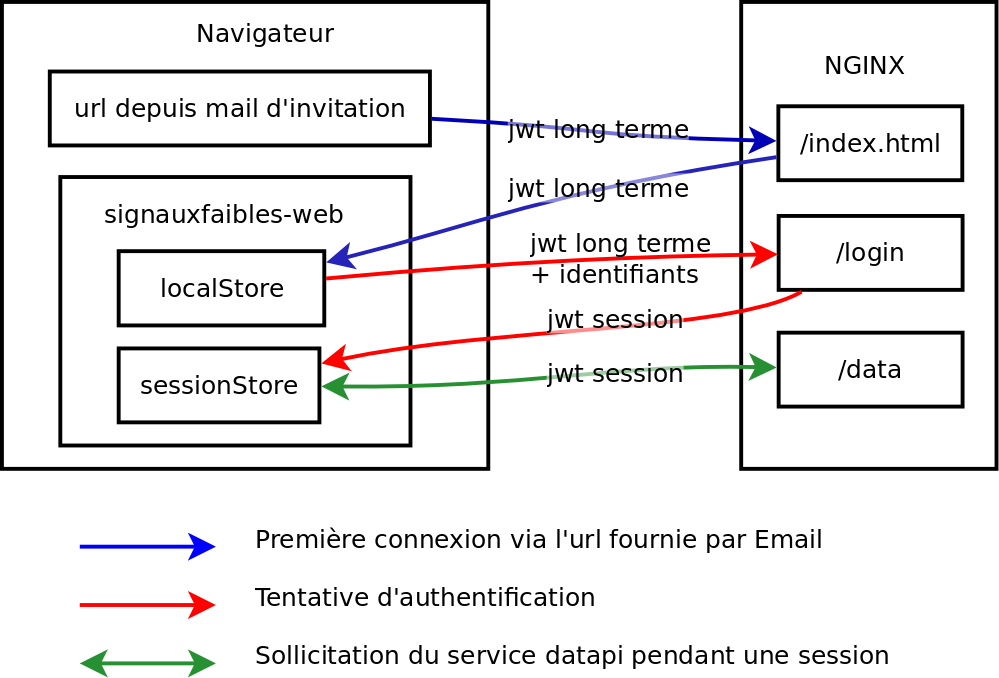

# Architecture logicielle

<!-- START doctoc generated TOC please keep comment here to allow auto update -->
<!-- DON'T EDIT THIS SECTION, INSTEAD RE-RUN doctoc TO UPDATE -->

- [Objectifs du dispositif](#objectifs-du-dispositif)
- [Schéma fonctionnel](#sch%C3%A9ma-fonctionnel)
- [goup](#goup)
  - [Objectif](#objectif)
  - [Composition](#composition)
  - [Authentification JWT](#authentification-jwt)
  - [Traitement des fichiers uploadés](#traitement-des-fichiers-upload%C3%A9s)
  - [Structure du stockage](#structure-du-stockage)
  - [dépendances logicielles](#d%C3%A9pendances-logicielles)
- [opensignauxfaibles](#opensignauxfaibles)
  - [Objectif](#objectif-1)
  - [Modules](#modules)
    - [dbmongo](#dbmongo)
      - [Dépendances logicielles](#d%C3%A9pendances-logicielles)
      - [utilisation](#utilisation)
    - [module R/H2O](#module-rh2o)
  - [Flux de traitement](#flux-de-traitement)
  - [Publication vers datapi](#publication-vers-datapi)
- [datapi](#datapi)
  - [Objectif](#objectif-2)
  - [Principe d'alimentation](#principe-dalimentation)
  - [Principe de stockage / sécurité](#principe-de-stockage--s%C3%A9curit%C3%A9)
  - [Planification/péremption des données](#planificationp%C3%A9remption-des-donn%C3%A9es)
  - [Politiques de sécurité](#politiques-de-s%C3%A9curit%C3%A9)
  - [Principe de sécurité](#principe-de-s%C3%A9curit%C3%A9)
  - [Dépendances logicielles](#d%C3%A9pendances-logicielles-1)
- [signauxfaibles-web](#signauxfaibles-web)
  - [Connexion / Authentification](#connexion--authentification)
  - [architecture](#architecture)
  - [Dépendance logicielle](#d%C3%A9pendance-logicielle)
- [Briques extérieures](#briques-ext%C3%A9rieures)
  - [mongodb](#mongodb)
- [keycloak](#keycloak)
  - [Structure du chargement JWT](#structure-du-chargement-jwt)
  - [postgresql](#postgresql)
  - [client TUS](#client-tus)

<!-- END doctoc generated TOC please keep comment here to allow auto update -->

## Objectifs du dispositif

- récolter les données brutes en provenance des partenaires (goup + stockage POSIX)
- traiter/importer les données brutes (opensignauxfaibles + mongodb)
- raffiner les données pour obtenir les variables nécessaires à la bonne marche de l'algorithme (opensignauxfaibles + mongodb)
- exécuter la détection algorithmique (opensignauxfaibles + mongodb)
- publier les données à destination des agents (datapi + postgresql + signauxfaibles-web)

## Schéma fonctionnel


## goup

Plus de détails sont disponibles [ici](https://github.com/signaux-faibles/goup)

### Objectif

goup permet aux partenaires de déposer les fichiers de données brutes sur la plateforme.

### Composition

goup est basé sur [tusd](https://github.com/tus/tusd) et lui ajoute des fonctionnalités:

- authentification par JWT
- espaces privatifs par utilisateurs (gestion des droits et des chemins)
- supprime la possibilité de télécharger les fichiers

### Authentification JWT

En l'absence d'un JWT valide, le service refuse les sollicitations.  
Ce token devra en plus fournir dans son chargement une propriété `goup-path` correspondant au nom d'utilisateur posix ciblé par le versement.

### Traitement des fichiers uploadés

- Lors de l'envoi, le fichier n'est accessible qu'au serveur
- La métadonnée `private` associée à l'upload permettra au serveur de décider quel traitement effectuer sur le fichier pour sa mise à disposition.
- Une fois l'envoi complété, le fichier reste disponible dans l'espace du serveur de sorte qu'il pourra naturellement détecté que le fichier est déjà complet et éviter un deuxième envoi.
- Les droits sont fixés sur le fichier pour limiter l'accès aux utilisateurs souhaités (grace à la propriété `goup-path`)
- Un lien est créé dans l'espace de stockage ad-hoc.

### Structure du stockage

Le fichiers uploadés sont matérialisés sur le disque dur par deux fichiers nommés d'après le hash de l'upload généré par TUS:

- un fichier .bin qui contient les données du fichier
- un fichier .info qui contient les métadonnées

Le stockage est organisé dans 2 répertoires permanents:

- tusd: espace de traitement des upload par le serveur et accessible uniquement par ce dernier
- public: espace commun à tous les utilisateurs

1 répertoire privé pour chaque utilisateur (voir exemple ci-dessous)

Voici l'état du stockage après l'upload de 4 fichiers par deux utilisateurs:

- file1: user1, envoi public
- file2: user1, envoi privé
- file3: user2, envoi public
- file4: user2, envoie privé

```
chemin                           user:group            mode

.
+-- tusd                         goup:goup             770
|   +-- file1.bin                user1:users           660
|   +-- file1.info               user1:users           660
|   +-- file2.bin                user1:goup            660
|   +-- file2.info               user1:goup            660
|   +-- file3.bin                user2:users           660
|   +-- file3.info               user2:users           660
|   +-- file4.bin                user2:goup            660
|   +-- file4.info               user2:goup            660
+-- public                       user1:users           770
|   +-- file1.bin                user1:users           660
|   +-- file1.info               user1:users           660
|   +-- file3.bin                user2:users           660
|   +-- file3.info               user2:users           660
+-- user1                        user1:goup            770
|   +-- file2.bin                user1:goup            660
|   +-- file2.info               user1:goup            660
+-- user2                        user2:goup            770
|   +-- file4.bin                user2:goup            660
|   +-- file4.info               user2:goup            660
```

### dépendances logicielles

goup est développé en go (v1.10) et exploite les packages suivants:

- https://github.com/tus/tusd
- https://github.com/tus/tusd/filestore
- https://github.com/appleboy/gin-jwt
- https://github.com/gin-contrib/cors
- https://github.com/gin-gonic/gin
- https://github.com/spf13/viper

## opensignauxfaibles

### Objectif

opensignauxfaibles se charge du traitement des données:

- import des fichiers bruts
- calcul des données d'entrée de l'algorithme
- stockage des résultats

Cette brique intègre le stockage de l'historique des données brutes, mais aussi calculées, ainsi que des résultats de façon à permettre l'audit des calculs a posteriori.

### Modules

#### dbmongo

Ce module est écrit en go (1.10) et centralise les fonctions de traitement des données suivantes:

- analyse des fichiers bruts
- conversion/insert dans mongodb
- ordonnancement des traitements mapreduce/aggregations mongodb
- publication vers datapi

##### Dépendances logicielles

- https://github.com/appleboy/gin-jwt
- https://github.com/gin-contrib/cors
- https://github.com/gin-contrib/static
- https://github.com/gin-gonic/gin
- https://github.com/gorilla/websocket
- https://github.com/spf13/viper
- https://github.com/swaggo/gin-swagger
- https://github.com/swaggo/gin-swagger/swaggerFiles
- https://github.com/globalsign/mgo
- https://github.com/globalsign/mgo/bson
- https://github.com/spf13/viper
- https://github.com/tealeg/xlsx
- https://github.com/chrnin/gournal
- mongodb 3.6

##### utilisation

dbmongo propose une api pour ordonner les traitements. Une documentation openapi est disponible [ici](https://raw.githubusercontent.com/signaux-faibles/opensignauxfaibles/master/dbmongo/docs/swagger/swagger.yaml)

#### module R/H2O

Ce module permet le traitement algorithmique. (à écrire)

### Flux de traitement



1. Lecture des fichiers bruts ([dbmongo](#dbmongo))
1. Les données brutes sont converties et insérées dans mongodb ([dbmongo](#dbmongo))
1. Les données sont compactées dans mongodb par un traitement map-reduce ([dbmongo](#dbmongo))
1. Les variables sont calculées dans mongodb par un traitement map-reduce ([dbmongo](#dbmongo))
1. Le traitement algorithmique est effectué par le module [R/H2O](#module-rh2o)
1. Les résultats sont injectés dans mongodb par le module [R/H2O](#module-rh2o)
1. Les données nécessaires au frontend sont exportées dans datapi par le module ([dbmongo](#dbmongo))

Pour plus de détail sur le traitement des données et les transformations qui leur sont appliquées, voir [ici](processus-traitement-donnees.md).

### Publication vers datapi

opensignauxfaibles dispose d'un identifiant lui ouvrant la possibilité de publier des données sur datapi.
Il lui incombe de fournir à datapi:

- des données détaillées sur les établissements et les entreprises (niveau A)
- des données synthétiques sur les établissements et les entreprises (niveau B)
- les listes de détection (niveau A)
- les badges de sécurité pour tous les objets exportés afin d'appliquer les niveaux de sécurité.

Ce traitement est écrit en dur dans le code de dbmongo [ici](https://github.com/signaux-faibles/opensignauxfaibles/blob/master/dbmongo/lib/engine/datapi.go)

## datapi

Le détail sur le fonctionnement de Datapi est disponible [ici](https://github.com/signaux-faibles/datapi)

datapi est écrit en go (1.10) et se base sur postgresql (10).

### Objectif

Dans cette infrastructure, datapi est la brique permettant la diffusion contrôlée des données produites dans le projet et sert notamment de back-end pour le signauxfaibles-web.  
Parmi les fonctionnalités notables:

- stockage arbitraire d'objets JSON
- gestion dynamique des permissions en lecture/écriture
- journalisation des requêtes
- programmation de la péremption des données

### Principe d'alimentation


Il est à noter que:

- les insertions et lectures de données sont effectuées au sein de transactions postgres.
- la prise en compte de l'ajout de données et de politiques de sécurité est intégrée dans le système transactionnel de façon à présenter un comportement synchrone
- les permissions accordées aux utilisateurs sont véhiculées dans le token JWT et reposent sur la sécurité de keycloak, on les retrouve dans les rôles clients communiqués dans le token.

### Principe de stockage / sécurité

Un object datapi est identifié par une clé et de multiples feuillets composés d'un scope de sécurité (ensemble des badges nécessaires) et d'un objet contenant les données souhaitées.

datapi propose par ailleurs un système de paniers d'objets (buckets) qui permet de faciliter l'encodage des politiques de sécurité. Les politiques de sécurité sont stockées dans le bucket `system`.

Avec l'exemple ci-dessous, nous avons un objet qui pourra-être vu de 3 façons différentes selon le niveau d'accéditation:


- un utilisateur disposant d'un scope vide verra:

```javascript
{
  raisonSociale: "TEST";
}
```

- un utilisateur disposant du scope [bfc]:

```javascript
{
  raisonSociale: "TEST",
  activitePartielle: [..., ..., ...]
}
```

- un utilisateur disposant du scope [bfc, crp]:

```javascript
{
  raisonSociale: "TEST",
  activitePartielle: [..., ..., ...],
  debitUrssaf: [..., ..., ...],
  bilanBDF: [..., ..., ...]
}
```

Une requête consiste à demander au serveur d'assembler les feuillets de tous les objets contenant la clé fournie dans la requête. Ce principe est appuyé sur l'opérateur `@>` du type hstore fourni par postgres, et comme on peut le voir ci-dessus, seuls les feuillets visibles par l'utilisateur sont utilisés dans l'assemblage.
Seul le premier niveau de clé de l'objet contenu dans la valeur d'un objet sont confrontés, ce qui expose le système à des risques de collision, et dans ce cas, c'est la valeur insérée en dernier qui remplace les valeurs précédentes.

### Planification/péremption des données

Il est possible de fournir à datapi une date de publication à un feuillet de données, et dans ce cas, ce feuillet sera ignoré tant que la date système n'aura pas atteint cette valeur.

La péremption des données est obtenue en publiant une version vide écrasant la donnée que l'on souhaite oblitérer avec une date de publication correspondant à la date de péremption.

Ce principe seul ne permet pas de supprimer les données de la base de données, il ne fait qu'en contenir la diffusion, toutefois il est envisagé d'avoir un traitement planifié pour retrouver toutes ces valeurs les oblitérer.

### Politiques de sécurité

Une politique de sécurité permet d'intéragir avec les permissions accordées aux utilisateurs. Le périmètre d'application d'une politique de sécurité est définie par une clé d'objet, un scope, un ensemble de buckets (définis par une expression régulière).

- en ajoutant des badges aux utilisateurs
- en ajoutant des badges aux objets

### Principe de sécurité

- Une ressource comporte des «badges» de sécurité (une liste de tags), les utilisateurs disposent dans leurs attributions de badges.
- Une ressource n'est disponible à un utilisateur que si il dispose de l'ensemble des badges demandés par la ressource.
- Des politiques de sécurités permettent de fixer des règles ajoutant des badges aux ressources (renforcement de la contrainte de sécurité) ou aux utilisateurs (promotion)
- Les politiques de sécurité peuvent s'appliquer à un ensemble d'objets

### Dépendances logicielles

- postgresql v10
- https://github.com/gin-contrib/cors
- https://github.com/gin-gonic/gin
- https://github.com/appleboy/gin-jwt
- https://github.com/swaggo/gin-swagger
- https://github.com/swaggo/gin-swagger/swaggerFiles
- https://github.com/gin-gonic/gin
- https://github.com/lib/pq
- https://github.com/lib/pq/hstore
- https://golang.org/x/crypto/bcrypt

## signauxfaibles-web

Il s'agit de l'interface utilisée par les agents.
Cette interface communique avec datapi.

### Connexion / Authentification


Les tokens JWT (long terme et session) contiennent notamment dans leur chargement l'adresse email de l'agent auquel il est adressé et un contrôle est effectué pour prévenir une connexion avec un autre profil.

### architecture

signauxfaibles-web est une application vuejs codée en typescript avec les modules suivantes:

- vuetify: environnement graphique
- vuex: gestion d'un store partagé de variables entre composants
- axios: client http asynchrone pour traiter les appels à datapi
- echarts: environnement pour tracer des graphiques

### Dépendance logicielle

Voici la liste des modules yarn nécessaires à la compilation du projet vue.

- @babel/core (7.4.3)
- axios (0.18.0)
- core-js (2.6.5)
- echarts (4.2.1)
- jest" (>=22 <24)
- vue (2.6.10)
- vue-class-component (7.0.2)
- vue-echarts-v3 (2.0.1)
- vue-native-websocket (2.0.13)
- vue-property-decorator (8.1.0)
- vue-router (3.0.3)
- vuetify (1.5.5)
- vuex (3.0.1)
- vuex-persistedstate (2.5.4)
- webpack (4.30.)
- @types/jest (23.1.4)
- @vue/cli-plugin-babel (3.6.0)
- @vue/cli-plugin-e2e-nightwatch (3.6.0)
- @vue/cli-plugin-typescript (3.6.0)
- @vue/cli-plugin-unit-jest (3.6.0)
- @vue/cli-service (3.6.0)
- @vue/test-utils (1.0.0-beta.29)
- babel-core (7.0.0-bridge.0)
- stylus (0.54.5)
- stylus-loader (3.0.1)
- ts-jest (23.0.0)
- typescript (3.4.3)
- vue-cli-plugin-vuetify (0.5.0)
- vue-template-compiler (2.5.21)
- vuetify-loader (1.0.5)

## Briques extérieures

### mongodb

La version de mongodb utilisée est la 3.6.

## keycloak

Il s'agit du produit officiel développé par Red-Hat.
KeyCloak fournit les services d'authentification pour `goup` et `datapi` en forgeant les JWT des utilisateurs.

Ce produit est utilisé en version 6.0.1.

### Structure du chargement JWT

Le chargement du token est effectué par keycloak à l'aide du modèle utilisateur.

Un attribut utilisateur `goup-path` fixé dans keycloak sera utilisé pour fixer le nom d'utilisateur à utiliser sur l'infrastructure pour l'enregistrement des fichiers.

Le scope utilisé par datapi sera accessible au travers des rôles clients configurés également dans keycloak et fixés par utilisateur.

### postgresql

La version utilisée est la 10.8.
Le module hstore du packages contrib est utilisé.

### client TUS

Un exemple de client tus est fourni [ici](https://github.com/signaux-faibles/goup/tree/master/goup-client) et permet de voir une implémentation javascript basée sur le client officiel.  
On trouve toutefois des clients dans de nombreux langages qui permettront aux utilisateurs d'intégrer l'upload de fichier dans leurs plateformes.
