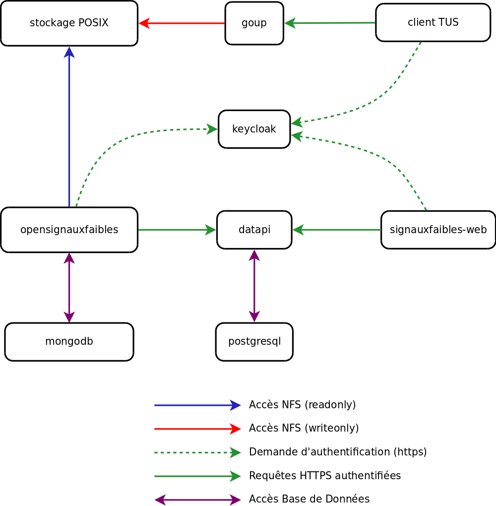

# Architecture logicielle

## Objectifs du dispositif
- récolter les données brutes en provenance des partenaires (goup + stockage POSIX) 
- traiter/importer les données brutes (opensignauxfaibles + mongodb)
- raffiner les données pour obtenir les variables nécessaires à la bonne marche de l'algorithme (opensignauxfaibles + mongodb)
- exécuter la détection algorithmique (opensignauxfaibles + mongodb)
- publier les données à destination des agents (datapi + postgresql + signauxfaibles-web)

## Schéma fonctionnel

### Stockage POSIX

### goup

### client TUS 

### opensignauxfaibles

### datapi

### signauxfaibles-web

### mongodb

### postgresql
