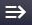
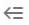
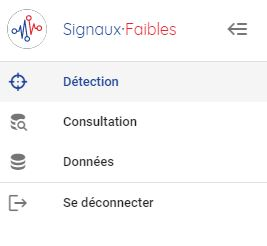
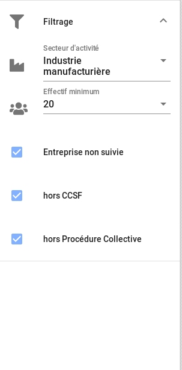
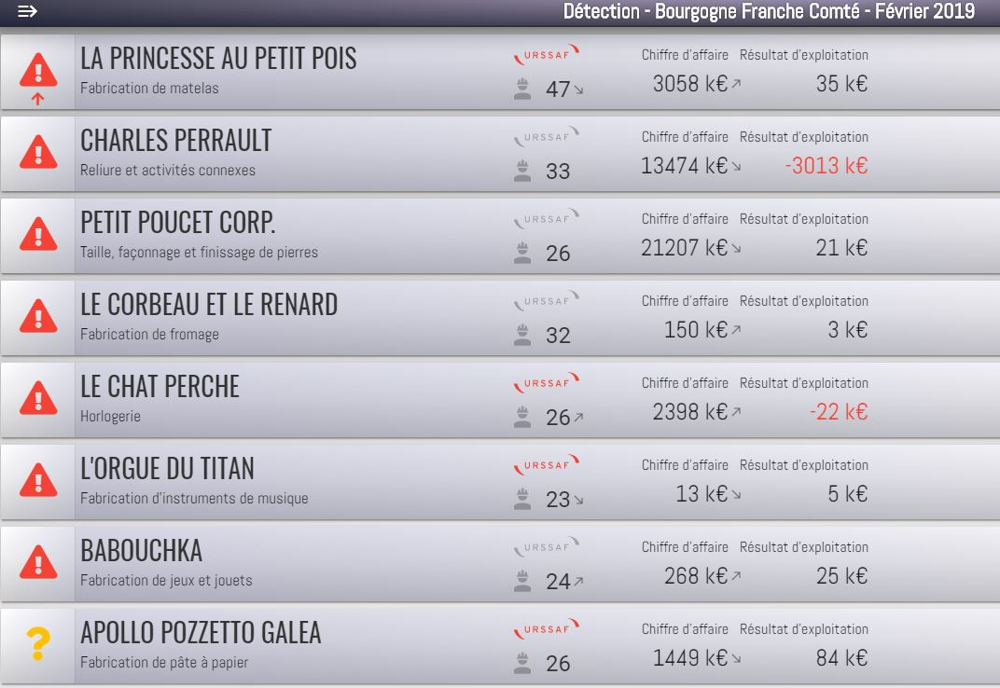
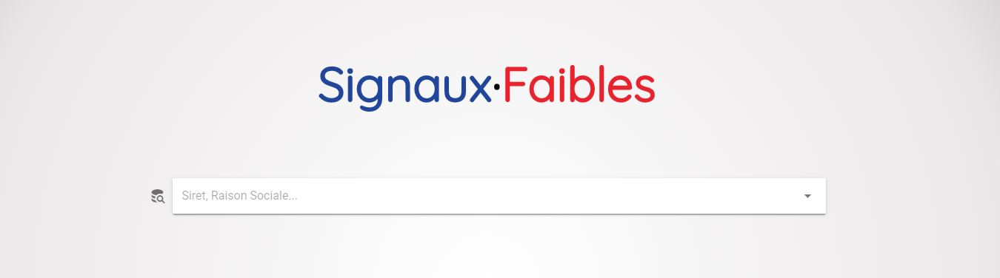

Documentation de l'interface graphique
======================================

Volet menu 
----------

Le volet menu permet de naviguer entre les différentes fonctionnalités de l'application, et de se déconnecter.

Les fonctionnalités disponibles dans le menu sont: 

- L'accès à la liste de détection en cliquant sur l'entrée **Détection**
- La fenêtre de recherche d'un établissement en particulier, en cliquant sur l'entrée **Consultation**
- L'entrée **Données** est à ignorer - elle ne concerne que les administrateurs des données. 

Le volet menu s'affiche avec l'icône  en haut à gauche, sur le ruban bleu. Elle se masque avec l'icône . 

Fenêtre Liste
-------------

La fenêtre liste permet d'explorer les entreprises détectées par l'algorithme. 

La première étape consiste à fixer le périmètre de l'exploration dans le volet filtrage. Dans ce volet figurent plusieurs options de définition du périmètre d'exploration: le choix d'un périmètre géographique, le choix d'un secteur d'activité, le choix d'un effectif minimum, et le filtrage d'entreprises déjà accompagnées, soit par un partenaire, ou dans le contexte d'une procédure collective ou un plan CCSF. 

Une fois ce périmètre fixé, les établissements correspondants apparaissent dans la liste centrale.
Les établissements sont ordonnées par ordre décroissant d'alerte. Le niveau d'alerte est donné par le pictogramme coloré à gauche. Le symbole rouge avec un point d'exclamation signifie fort niveau d'alerte, le symbole orange avec un point d'interrogation est un niveau d'alerte intermédiaire, et le symbole vert indique l'absence d'alerte.

Quelques données synthétiques complètent la présentation de l'établissement dans la liste: y figurent la raison sociale, le libellé du code naf (activité de l'entreprise). Si le voyant *urssaf* est rouge, alors l'entreprise a connu dans les 6 derniers mois un incident de paiement à l'URSSAF. Si le pictogramme représentant un ouvrier est rouge, alors l'entreprise a recouru à l'activité partielle. Le nombre indiqué à droite du pictogramme représente l'effectif de l'établissement.

À droite figurent le chiffre d'affaire et le résultat d'exploitation. Une flèche indique les variations de plus de 5% du chiffre d'affaire (augmentation ou diminution selon le sens de la flèche).
Le résultat d'exploitation est rouge lorsqu'il est négatif.

Pour inspecter un établissement plus en détail, il suffit de cliquer n'importe où sur la ligne de celui-ci.

Fiche établissement
---------------------

La fenêtre établissement donne une information plus détaillée de l'établissement en question. Le niveau de détail et le contenu de cette page dépend du niveau d'habilitation de l'utilisateur. 

On y trouve la raison sociale, le siret, le secteur d'activité de l'entreprise, sa localisation, des informations sur mes variations d'effectif et le recours à l'activité partielle, des informations sur les cotisations URSSAF, d'éventuels débits ou délais de paiements octroyés par l'URSSAF, des informations financières sur plusieurs exercices consécutifs. 

Rechercher un établissement
----------------------------

Depuis le menu, on peut chercher un établissement sur la page **Consultation** et accéder à sa fiche. 

Il suffit de rentrer le début de sa raison sociale, ou le début du code SIRET de l'établissement, puis de sélectionner l'établissement en question dans la liste déroulante, pour pouvoir accéder à la fiche établissement correspondante. 

F.A.Q.
------

Cette section sera complétée au fur et à mesure des questions des utilisateurs.