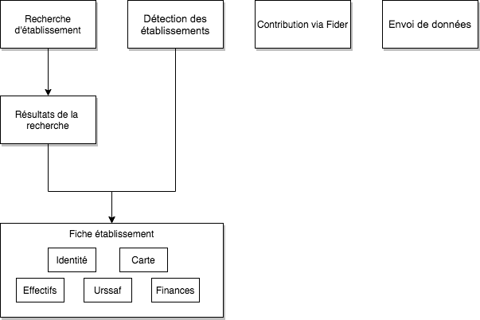
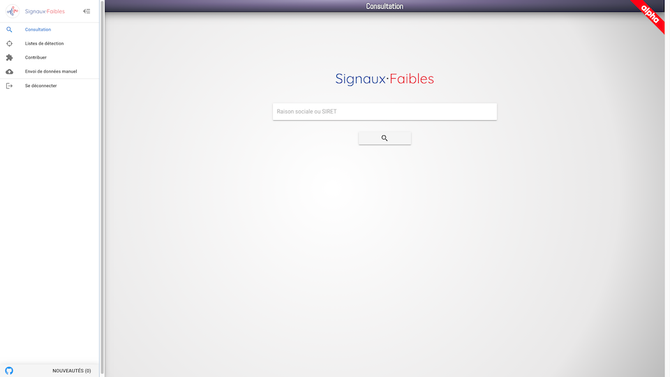
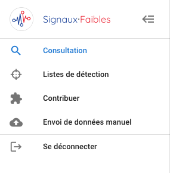
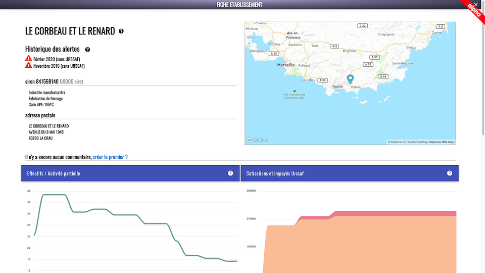
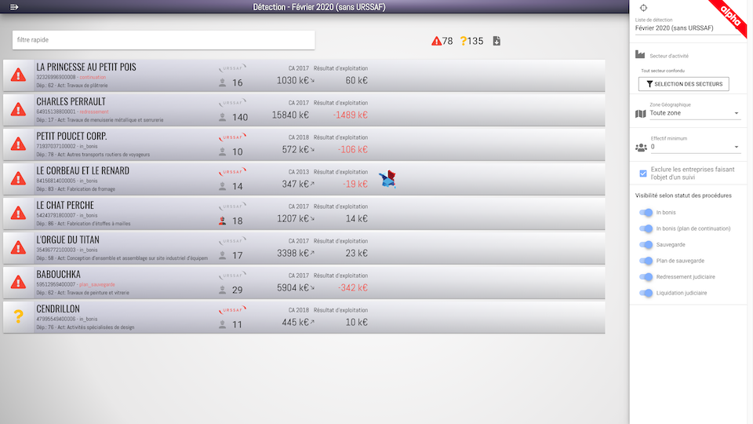
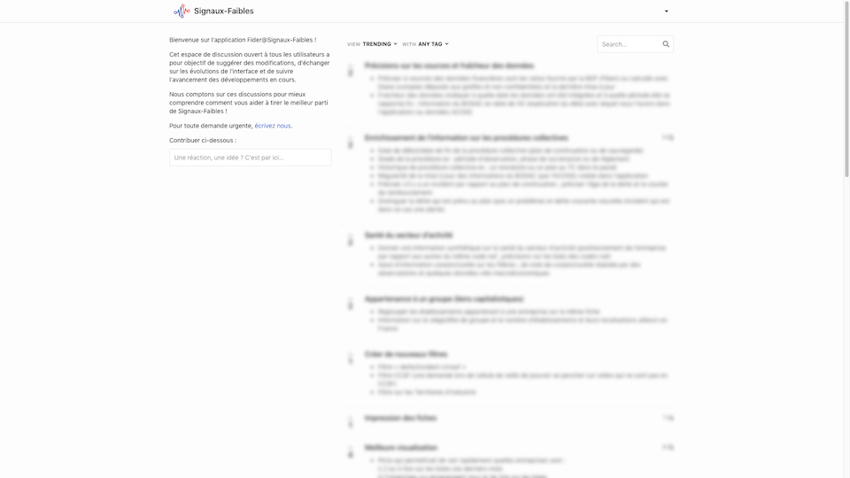
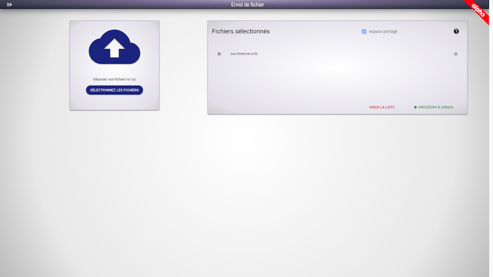

# Documentation de l'interface graphique

<!-- START doctoc generated TOC please keep comment here to allow auto update -->
<!-- DON'T EDIT THIS SECTION, INSTEAD RE-RUN doctoc TO UPDATE -->

- [Sitemap](#sitemap)
- [Aperçu global de l'interface graphique](#aper%C3%A7u-global-de-linterface-graphique)
- [Volet menu](#volet-menu)
- [Recherche d'établissement](#recherche-d%C3%A9tablissement)
- [Fiche établissement](#fiche-%C3%A9tablissement)
- [Détection des établissements](#d%C3%A9tection-des-%C3%A9tablissements)
- [Contribution via Fider](#contribution-via-fider)
- [Envoi de données](#envoi-de-donn%C3%A9es)
- [F.A.Q.](#faq)

<!-- END doctoc generated TOC please keep comment here to allow auto update -->

## Sitemap

## Aperçu global de l'interface graphique

## Volet menu

Le volet menu s'affiche et se ferme via l'icône en haut à gauche.
Il permet de naviguer entre les différentes fonctionnalités de l'application et de se déconnecter.

Les fonctionnalités accessibles via le menu sont :

- La page de recherche d'un établissement, en cliquant sur l'entrée **Consultation**
- L'accès aux listes de détection d'établissements, via l'entrée **Listes de détection**
- L'utilitaire externe de contribution Fider, en cliquant sur l'entrée **Contribuer**
- L'envoi de données manuel, via l'entrée **Envoi de données manuel**

## Recherche d'établissement

Depuis le menu, on peut rechercher un établissement sur la page **Consultation**.

Pour pouvoir accéder à la fiche d'un établissement, il suffit de rentrer le début de sa raison sociale ou le code SIRET de l'établissement puis de sélectionner l'établissement voulu dans la liste de résultats.

## Fiche établissement

La fiche établissement est accessible depuis la recherche d'établissement et depuis les listes de détection.
Elle donne une information détaillée sur l'établissement en question. Le niveau de détail et le contenu de cette page dépend du niveau d'habilitation de l'utilisateur.

On y trouve :

- l'identité de l'établissement complétée de son historique d'alerte
- son adresse postale et sa localisation sur la carte
- un espace de commentaires qui permet la création de fils de discussions entre utilisateurs
- les variations d'effectif et le recours ou non à l'activité partielle
- les cotisations URSSAF appelées et d'éventuelles dettes à payer (soit sur la part salariale soit sur la part patronale)
- des informations financières (telles que le chiffre d'affaire, le résultat d'exploitation, le résultat net, les délais fournisseur et client, le poids du fonds de roulement net global et le taux de financement court terme) sur plusieurs exercices consécutifs

## Détection des établissements

La liste permet d'explorer les entreprises détectées par l'algorithme.

La première étape consiste à fixer le périmètre de l'exploration dans le volet filtrage situé à droite. Dans ce volet figurent plusieurs options de filtrage : le choix de la liste de détection datée, le choix d'un secteur d'activité (parmi les 21 sections NAF), le choix d'une zone géographique (nationale, régionale, départementale), le choix d'un effectif minimum (de 10 à 100), l'exclusion des entreprises faisant déjà l'objet d'un suivi ou selon une procédure collective en cours.

Il est également possible d'utiliser un filtre de recherche rapide sur la raison sociale ou sur le numéro de SIRET.

Une fois ce périmètre fixé, les établissements correspondants apparaissent dans la liste centrale et les données sont exportables au format CSV.
Les établissements sont ordonnées par ordre décroissant d'alerte. Le niveau d'alerte est donné par le pictogramme coloré à gauche. Le symbole rouge avec un point d'exclamation signifie fort niveau d'alerte, le symbole jaune avec un point d'interrogation est un niveau d'alerte intermédiaire et le symbole vert indique l'absence d'alerte.

Quelques données synthétiques complètent la présentation de l'établissement dans la liste. Y figurent la raison sociale, le numéro de SIRET, le statut des procédures en cours, le département géographique et le libellé du code NAF (activité de l'entreprise).

Si le voyant _URSSAF_ est rouge, alors l'entreprise a connu une augmentation des débits sur les 3 derniers mois.
Si le pictogramme représentant un ouvrier est rouge, alors l'entreprise a recouru à l'activité partielle. Le nombre indiqué à droite du pictogramme représente l'effectif de l'établissement.

Plus à droite figurent le chiffre d'affaire le plus récent connu et le résultat d'exploitation. Une flèche indique les variations de plus de 5% du chiffre d'affaire (augmentation ou diminution selon le sens de la flèche). Le résultat d'exploitation est rouge lorsqu'il est négatif.

Pour consulter la fiche établissement, il suffit de cliquer n'importe où sur la ligne de celui-ci.

## Contribution via Fider

Fider nous permet de collecter les retours et suggestions de nos utilisateurs, d'y réagir et de prioriser leur traitement.

## Envoi de données

Cette fonctionnalité d'envoi de données n'est disponible qu'à un nombre restreint d'utilisateur, les administrateurs des données.

Une zone de dépôt est présente sur la partie gauche de la page et permet de sélectionner les fichiers à envoyer. Une fois les fichiers sélectionnés, il suffira de choisir via une case à cocher si l'envoi devra être effectué dans un espace partagé (choix par défaut) ou non (espace privé) puis de cliquer sur "▶ PROCÉDER À L'ENVOI". Le statut d'envoi de chacun des fichiers sera alors visible à l'écran.

## F.A.Q.

Cette section sera complétée au fur et à mesure des questions des utilisateurs.
