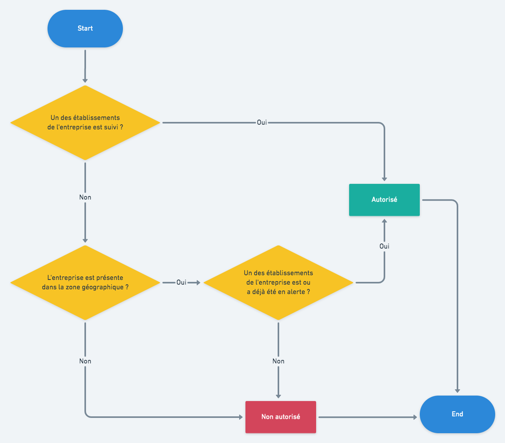

<!-- START doctoc generated TOC please keep comment here to allow auto update -->
<!-- DON'T EDIT THIS SECTION, INSTEAD RE-RUN doctoc TO UPDATE -->

- [Permissions d'accès](#permissions-dacc%C3%A8s)
  - [Préambule](#pr%C3%A9ambule)
  - [Flowchart des permissions générales](#flowchart-des-permissions-g%C3%A9n%C3%A9rales)
  - [Restrictions particulières suivant la nature des données](#restrictions-particuli%C3%A8res-suivant-la-nature-des-donn%C3%A9es)

<!-- END doctoc generated TOC please keep comment here to allow auto update -->

# Permissions d'accès

## Préambule

Nos utilisateurs sont autorisés à accéder aux entreprises et établissements présents dans Signaux Faibles selon :

- s'ils suivent un des établissements de l'entreprise
- si l'entreprise est présente dans leur zone géographique
- si un des établissements de l'entreprise est ou a déjà été en alerte

Un niveau complémentaire de restrictions provenant des habilitations des utilisateurs est appliqué sur des données de nature particulière présentes sur les fiches établissement et entreprise.

## Flowchart des permissions générales

## Restrictions particulières suivant la nature des données

- Permission d'accès aux scores produits par l'algorithme de détection Signaux Faibles
- Permission d'accès aux données fournies par la DGEFP : autorisations et consommations d'activité partielle
- Permission d'accès aux données fournies par l'URSSAF : montant des cotisations, montant des dettes (part patronale, part ouvrière)
- Permission d'accès aux données fournies par la Banque de France
