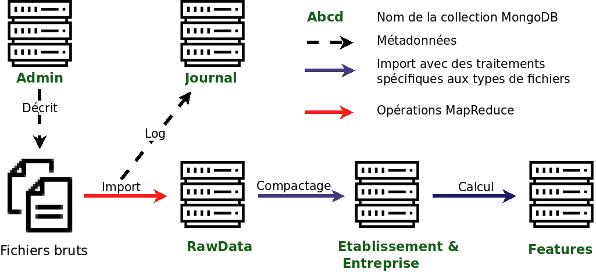

# Processus traitement des données

<!-- START doctoc generated TOC please keep comment here to allow auto update -->
<!-- DON'T EDIT THIS SECTION, INSTEAD RE-RUN doctoc TO UPDATE -->

- [Préambule](#pr%C3%A9ambule)
- [Vue d'ensemble des canaux de transformation des données](#vue-densemble-des-canaux-de-transformation-des-donn%C3%A9es)
- [Workflow classique](#workflow-classique)
- [L'API servie par Golang](#lapi-servie-par-golang)
- [La base de données MongoDB](#la-base-de-donn%C3%A9es-mongodb)
- [Spécificités de l'import](#sp%C3%A9cificit%C3%A9s-de-limport)
- [Spécificités du compactage](#sp%C3%A9cificit%C3%A9s-du-compactage)
- [Spécificités des calculs de variables](#sp%C3%A9cificit%C3%A9s-des-calculs-de-variables)
- [La commande batch/process](#la-commande-batchprocess)

<!-- END doctoc generated TOC please keep comment here to allow auto update -->

## Préambule

Dans cette partie, nous explorons comment sont stockées et transformées les données à partir des fichiers bruts.

Note: Vous pouvez installer la commande `http` utilisée dans les exemples de cette page à partir de [HTTPie – command line HTTP client](https://httpie.org/).

## Vue d'ensemble des canaux de transformation des données

La base de donneé MongoDB dans laquelle les données sont intégrées est définie dans le fichier config.toml.

Le schéma ci-dessous montre les différentes étapes de transformation des données.



L'intégration et le stockage de données se fait par mises-à-jours successives, qu'on appelle "batch". Le parcours de la données est alors à chaque fois identique.

**1- Import**

Ce parcours est représenté avec des flêches pleines. Toutes les nouvelles données sont d'abord importées dans une collection ImportedData à l'aide de fonctions golang spécifiques à chaque type de fichier. La collection Admin définit quels sont les fichiers à intégrer pour chaque "batch". Le processus d'intégration et les potentielles erreurs d'ouverture de fichier, de lecture, ou de conversion sont logués dans la collection Journal.

Les données ainsi intégrées proviennent de fichiers de différents formats: .csv, .excel, .sas7dbat etc. La façon dont les données sont mises-à-jour peut également être différente, avec des fichiers qui annulent et remplacent, qu'on qualifiera de "fichiers stocks", et des fichiers qui viennent amender, qu'on qualifiera de "fichiers flux". Ceci est configuré dans la collection admin.

**2- Compactage**

Une fois le batch importées dans la collection ImportedData, elles vont venir compléter la collection RawData, qui concentrent les informations autour de l'établissement (identifiant: numéro siret) ou de l'entreprise (identifiant: numéro siren). C'est une opération de MapReduce qui est utilisé à cet effet.

Le processus de compactage consiste à attribuer à chaque objet les nouvelles données qui le concernent, vérifier si ces donneés étaient déjà connues (auquel cas l'objet n'est pas modifié), si les données amendent les informations connues, ou si des informations connues, qui ne seraient plus d'actualité, sont à supprimer.

La collection RawData conserve l'historique des modifications successives à chaque batch, ce qui rend possible de rétablir chaque objet dans son état après l'intégration de n'importe quel batch.

Si le compactage réussit, la collection ImportedData est purgée.

**3- Calcul des variables**

Enfin, les données ainsi stockées vont servir au calcul des variables qui alimenteront l'algorithme, stockées dans la collection Features. C'est à nouveau une opération de MapReduce qui permet de prendre en compte l'historique des données conservées dans RawData et calculer les variables pertinentes.

## Workflow classique

Le workflow classique d'intégration consiste à:

- Lancer l'API: `go build && ./dbmongo`

- Définir l'objet batch dans la collection Admin, avec les chemins d'accès des fichiers à intégrer
- Apeler la fonction d'intégration process, qui va se charger de l'import, du compactage et du calcul de variables avec les options idoines:

```
  http :3000/api/admin/batch/process batches:='["1904"]'
```

Toutes ces étapes seront détaillées par la suite.

Il est à noter qu'aucun travail d'UX n'a encore été mené, et donc peu d'information sur les travaux en cours peuvent être donnés à l'utilisateur.
Au cours de l'import, un log des début et des fin d'intégration de fichiers et de types de fichiers sont loggés dans la collection Journal.
Pendant le compactage et le calcul des variables, le log de mongodb peut être consulté.
Entre ces traitements, une façon de s'assurer que le processus tourne est de vérifier qu'il n'y a pas d'erreur golang, et que mongodb travaille, par exemple avec la commande _top_.

## L'API servie par Golang

L'intégralité des opérations sur les données se font au moyen d'une API servie par Golang, qui analyse et cadence les opérations à effectuer sur la base mongodb.
L'API est ouverte avec la commande suivante, à exécuter dans le répertoire `./dbmongo` du projet.

```
go build && ./dbmongo
```

L'API est alors lancée sur localhost, par défaut sur le port 3000 (le port peut-être modifié dans le fichier `./dbmongo/config.toml`)

Cette API est documentée par swagger, et est alors accessible sur `localhost:3000/swagger/index.html`.

Certaines des commandes seront plus amplement détaillées dans ce qui suit.

## La base de données MongoDB

Le stockage des données se fait dans une base de données "objet", notre choix s'est porté sur MongoDB. L'adresse et le port de la base de données est spécifiée dans `./dbmongo/config.toml`.

Les différentes collections utilisées seront détaillées par la suite.

## Spécificités de l'import

L'import est le processus qui consiste à récupérer les fichiers bruts, c'est-à-dire dans le format dans lequel il a été transmis, de le lire, d'en extraire les informations pertinentes et de les intégrer dans la base de données mongodb.

L'intégration se fait par "batch". Chaque batch est défini dans la collection "Admin" de la base MongoDB par un objet de la forme suivante:

```js
{
  "_id": {
    "key": "1802", // Doit être en ordre alphabétique
    "type": "batch"
  },
  "files": {
    "admin_urssaf": ["/1802/admin_urssaf/admin_urssaf.csv"],
    "autre_type": ["Chemin/daccès/1.xlsx", "Chemin/daccès/2.xlsx"]
  },
  "readonly": true,
  "complete_types": ["apconso", "apdemande", "effectif"],
  "param": {
    "date_debut": ISODate("2014-01-01T00:00:00.000+0000"),
    "date_fin": ISODate("2018-12-01T00:00:00.000+0000"),
    "date_fin_effectif": ISODate("2018-06-01T00:00:00.000+0000")
  }
}
```

Le champ `_id` permet de spécifier qu'il s'agit un objet batch, et lui donne un nom, sous forme de clé. Attention, les batchs seront traités par ordre alphabétique. Par convention, les batchs sont intitulés "AAMM", en fonction de la période à laquelle ils sont intégrés, et peuvent être découpés en plusieurs parties nommée "AAMM_partX" ou X est incrémenté à chaque partie. Le champ `key` doit être unique.

Le champs `files` associe à un type un ou plusieurs fichiers. Les types définissent quel script d'intégration sera utilisé pour intégrer les fichiers mentionnés. Les chemins d'accès sont spécifiées avec comme racine le dossier défini dans config.toml avec le champs `APP_DATA`, sans `.` préalable au début du chemin d'accès. Une liste des types et des fichiers associés est donné dans le tableau, plus bas.

Le champ `readonly` permet d'empêcher la modification de l'objet par l'API, une fois les traitements lancés, pour assurer l'adéquation entre l'objet dans Admin et les objets importés.

Le champ `complete_types` est utile pour le comportement de compactage (cf paragraphe suivant). Les fichiers des types complets annulent et remplacent toutes les données précédemment importées pour ce type, alors que les autres viennent compléter les données passées.

Le champ `param` est utile pour le calcul des variables (cf le paragraphe à ce sujet). Il définit l'étendu des périodes à traiter et la dernière période pour laquelle les données d'effectif sont disponibles.

Les types définis dans [handlers.go](https://github.com/signaux-faibles/opensignauxfaibles/blob/master/dbmongo/handlers.go) (variable `registeredParsers`) et reconnus par [prepare-import](https://github.com/signaux-faibles/prepare-import) sont accessibles via:

```
http :3000/api/admin/types
```

| Parser              | type         | extension    | Scope                                 |
| ------------------- | ------------ | ------------ | ------------------------------------- |
| urssaf.Parser       | admin_urssaf | csv          | table etablissement <-> compte Urssaf |
|                     | cotisation   | csv          | compte Urssaf                         |
|                     | procol       | csv          | etablissement                         |
|                     | debit        | csv          | compte Urssaf                         |
|                     | effectif     | csv          | etablissement                         |
|                     | delai        | csv          | compte Urssaf                         |
|                     | dpae         | csv          | compte Urssaf                         |
|                     | ccsf         | csv          | compte Urssaf                         |
|                     | dmmo         | xlsx         | compte Urssaf                         |
| apartconso.Parser   | apconso      | xlsx         | etablissement                         |
| apartdemande.Parser | apdemande    | xlsx         | etablissement                         |
| altares.Parser      | altares      | csv          | etablissement                         |
| bdf.Parser          | bdf          | csv          | entreprise                            |
| interim.Parser      | interim      | sas7dbat     | etablissement                         |
| sirene.Parser       | sirene       | csv          | etablissement                         |
| diane.Parser        | diane        | script + csv | entreprise                            |

Les fichiers en provenance des urssaf ont été regroupées dans un parser spécifique du fait de leur dépendance à la table de correspondance entre comptes Urssaf et codes Siret, qui est ainsi chargée une seule fois en mémoire.

L'import est lancé avec la requête:

```
http :3000/api/data/import [options]
# Par exemple
http :3000/api/data/import batch="1904" parsers:='["urssaf", "diane"]'
```

Le paramètre obligatoire `batch` indique la clé du batch à importer. Le paramètre optionnel `parsers`, qui est entré sous forme de tableau, permet de sélectionner les parsers à faire tourner. Par défaut, tous les parsers du batch sont lancés, cette option permet de corriger un type de fichier en particulier en cas d'erreur pendant l'intégration.

## Spécificités du compactage

Le compactage est la procédure de fusion des nouvelles données importées avec les données importées dans des batchs antérieurs.

Le paramètre `complete_types` dans la collection Admin définit la manière dont les nouvelles données se comportent par rapport au données existantes. Si le type est "complet", ou en "stock" (c'est-à-dire que chaque nouveau fichier reprèsente le stock à la période courante) alors les nouvelles données remplacent intégralement les dernières. Attention, si aucun fichier n'est intégré et que le type est considéré comme complet, alors toutes les données passées seront ignorées. Les types qui ne sont pas complets sont dits de "flux" (c'est-à-dire que chaque nouveau fichier vient compléter les fichiers des périodes précédentes), et les données précédentes sont conservées.

Par exemple, si certaines données n'ont pas changé d'une période sur l'autre, alors il n'est pas nécessaire de réintégrer de fichier mais simplement de veiller que le type n'est pas listé parmi les `complete_types`.

Le compactage se lance avec la commande suivante:

```
http :3000/api/data/compact [options]
# Par exemple
http :3000/api/data/compact batch="1804"
```

## Spécificités des calculs de variables

TODO
`param` dans la collection Admin

Le calcul des variables est lancé via la requête:

```
http :3000/api/data/reduce [options]
# Par exemple
http :3000/api/data/reduce batch="1904" key="01234567891011" features="algo2"
```

Les paramètres optionnels `batch` et `features` spécifient respectivement la clé du dernier batch intégré et le type de calcul à mener. Actuellement, uniquement "algo2" est fonctionnel.
Le paramètre facultatif `key` permet de ne faire tourner les calculs que pour un siret particulier, essentiellement pour des raisons de debugging.
Les données sont alors importées dans la collection `Features_debug` plutôt que dans la collection `Features`.

## La commande batch/process

La commande **batch/process** permet de lancer successivement l'import, le compactage et les calculs des variables pour un batch donné avec les options par défaut, en une seule commande.

Cette commande accepte plusieurs batches, auquel cas elle intégrera ces batches successivement.

```
http :3000/api/admin/batch/process [options]
http :3000/api/admin/batch/process batches:='["1904"]'
http :3000/api/admin/batch/process batches:='["1904", "1905"]'
```
